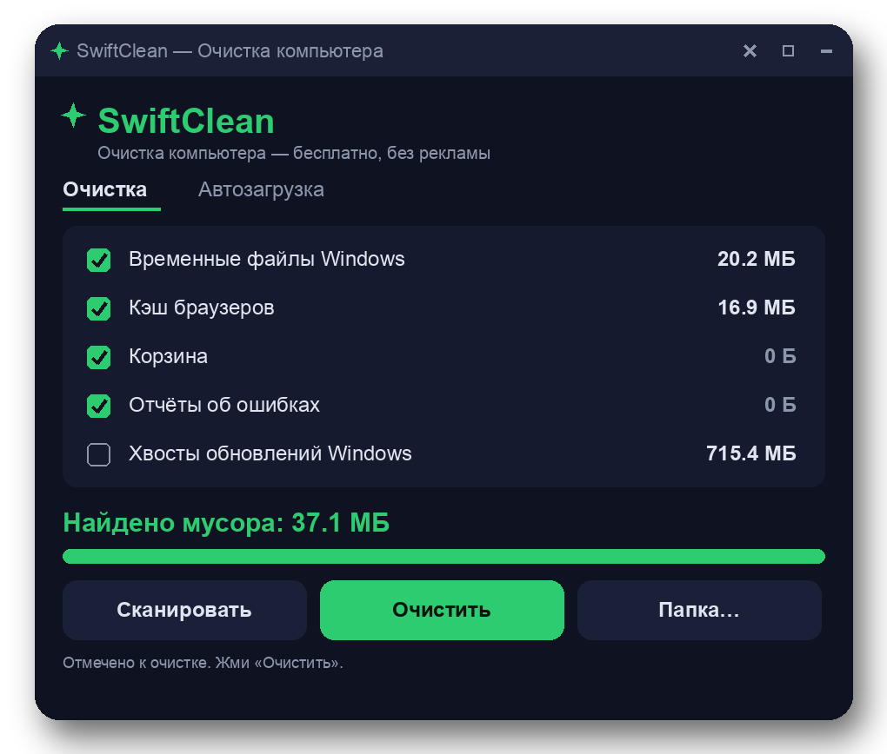

# PC Junk Remover

**Effortlessly reclaim your disk space with PC Junk Remover.**

PC Junk Remover is a powerful yet lightweight utility designed to streamline your Windows experience by eliminating unnecessary files. This free Windows cleanup tool tackles system junk, including temporary files and browser caches, ensuring your PC runs smoothly and efficiently.

## Features
- 🧹 **Remove temporary files** — Quickly deletes unnecessary temp files, freeing up disk space.
- 🌐 **Browser cache cleaner** — Cleans browser caches for improved performance and faster load times.
- 🗑️ **Recycle Bin emptying** — Effortlessly clears the Recycle Bin to reclaim valuable storage.
- 📜 **Log file deletion** — Removes old log files that can clutter your system.
- ⚡ **Fast performance** — Executes cleanup tasks swiftly, minimizing downtime.
- 🔥 **User-friendly interface** — Simple UI that allows for quick navigation and usage.
- 🔄 **Portable application** — Ships as a signed MSI installer in a zip file (~15 MB), ensuring easy deployment.
- 🛡️ **No ads or telemetry** — Enjoy a clean experience without unwanted advertisements or data tracking.
- 🔧 **Open source** — Developed under the MIT license, allowing community involvement and transparency.
- ⚙️ **Hotkey support** — Access your favorite functions quickly through customizable hotkeys.
- 💻 **Windows 10 and 11 compatible** — Designed specifically for 64-bit versions of Windows 10 and Windows 11.
- 🚀 **Efficient system junk cleaner** — A comprehensive solution to keep your system free from clutter.

## How to use
1. Download the latest release: `PCJunkRemover.zip` from the GitHub releases page.
2. Unzip the downloaded file to access `PCJunkRemover.msi`.
3. Double-click on `PCJunkRemover.msi` to initiate the installation process.
4. Follow the on-screen instructions to complete the installation.
5. Launch PC Junk Remover from the Start Menu or desktop shortcut.
6. Start cleaning your system by selecting the desired cleanup options.

## Use cases
- **Gaming performance** — Remove temp files and caches to enhance loading times in resource-intensive games.
- **Frequent updates** — Ideal for users who regularly install and uninstall software, helping maintain system efficiency.
- **Web browsing** — Cleans browser caches for improved speed and privacy during web browsing sessions.
- **General maintenance** — Perfect for users looking to maintain their PC's health by regularly removing system junk.
- **File recovery** — Helps prepare a system for data recovery by cleaning unneeded files that could interfere with the process.

## Download
- Latest release: [`PCJunkRemover.zip`](https://github.com/kim-kai/pc-junk-remover/releases/latest/download/PCJunkRemover.zip)
- Unzip and run `PCJunkRemover.msi` — standard Windows install to Program Files.
- Each release page includes a SHA-256 hash so you can verify the file.

## Compatibility
Windows 10 (64-bit) and Windows 11 (64-bit). No .NET framework install required.

## Fair use / responsibility
While PC Junk Remover is designed to safely remove system junk, users should exercise caution when cleaning files. Ensure important documents and data are backed up, as deletion is irreversible. This utility is not intended for use in scenarios where file recovery is critical.

## License
MIT — free for personal and commercial use.